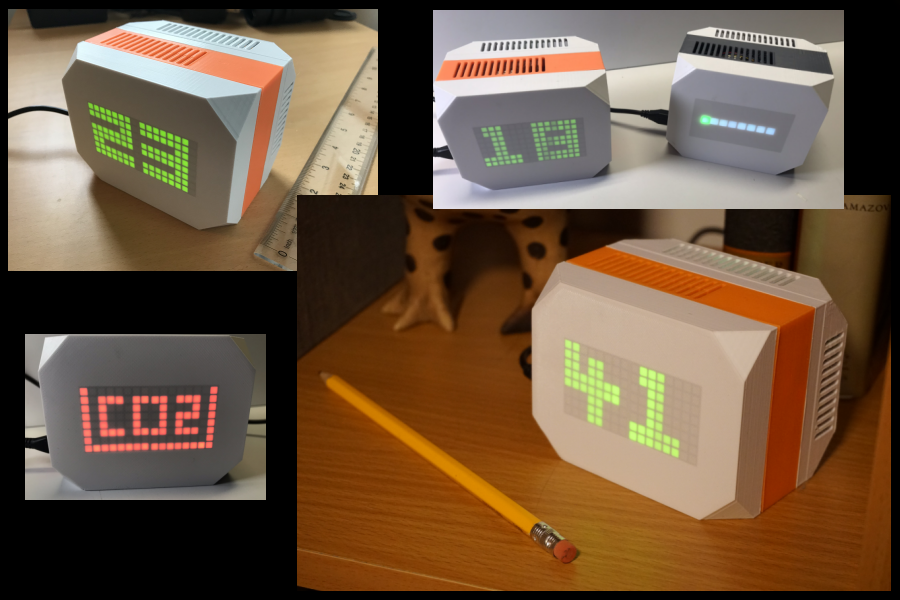
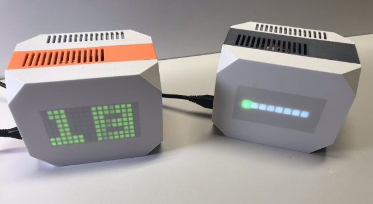

**The IAQ is an attractive device you can easily build that measures the quality of your indoor air and also provides readable feedback on an integrated LED display and a web dashboard.**

## Highlights

- **Works with multiple sensors**: Choose among CO2, particulate matter, temperature/humidity, and VOC sensors based on your needs and budget.
- **Multiple display options**: Choose either a bi-color LED matrix or a multi-color LED bargraph.
- **Your data stays local**: Your data remains your own. It is stored locally and can be accessed by a built-in secure web dashboard.

## Setup and configuration

Start by assembling the hardware - see our parts list and assembly instructions in [the docs](./docs). Deploying the code to a fleet of one or more devices is as easy as clicking the button below:

## Documentation

Head over to [our docs](./docs) for detailed parts lists, options, building, installation and usage instructions, customization options and more!

## Motivation

balenAir is a great starter project for learning about IoT, environmental sensors, containers, and the balena platform. It is also a very functional and useful device, which stores all of your data locally, not in the cloud. Yet you can access this data anywhere via its built-in web server and secure VPN tunnel.

This open source project is in active development so if you have any feature requests or issues please submit them here on GitHub. PRs are welcome, too.

## The IAQ score
The IAQ device uses a combination of CO2, VOC, and particulate sensors to generate an indoor air quality score.  The standard IAQ device displays the score using an LED matrix on the front of the unit. The easy-to-remember score ranges from 0 (best air quality) to 99 (hazardous air quality).

### The sensors
The project consists of up to three sensors but only one is required. You can choose any or all depending on your needs and budget. The air quality score is comprised of a combination of readings from the available sensors. 

- Particulate sensors for smoke, dust, pollen and other tiny particles
- CO2 sensor for exhaled breath and burning fossil fuels
- Volatile Organic Compound (VOC) sensor for gasses emitted by solid and liquid products
- Temperature and humidity environmental sensors

Since all of the sensors utilize an I2C Qwiic connector, no soldering is required. See the [parts list](./docs/01-hardware-selection.md#choosing-your-sensors) in the documentation for more details on cost and availability of these sensors.

### The display

The standard display uses two 1.2" Bi-color 8x8 LED Matrix displays that cost about $16 each ($32 total). This display provides visual feedback of the air quality score and changes color as the score increases. A less costly option utilizes an eight segment multi-color LED bargraph that displays the air quality score as a horizontal graph that also changes color as the score changes. 

The standard matrix display requires some soldering to build. The bargraph LED version can be built without any soldering.

You can build a working IAQ device for as little as $50! See the parts list in the [Hardware Selection Guide](./docs/01-hardware-selection.md) for more details on cost and availability of the display parts.

### The case

We provide STL files so you can use a 3D printer to print a beautiful case for the IAQ.

The case consists of four interlocking layers that are held together by four M3 x 40mm hex socket head screws. The case accomodates any or all of the supported sensors, two different Raspberry Pis, as well either of the display options.

See [the documentation](./docs/05-case-printing-and-assembly.md) for more information about printing and assembly of the case.

### The software

All of our software is open source so you can inspect it in this repository before you decide to build or purchase a device. The system is built on the [balena](www.balena.io) IoT platform which ensures easy software updates, secure URL access, and ease of maintenance.

## Getting Help

If you're having any problem, please [raise an issue](./issues/new) on GitHub and we will be happy to help.

## Contributing

Do you want to help make IAQ better? Take a look at our [Contributing Guide](CONTRIBUTING.md). Hope to see you around!

## License

IAQ is free software, and may be redistributed under the terms specified in the license.
