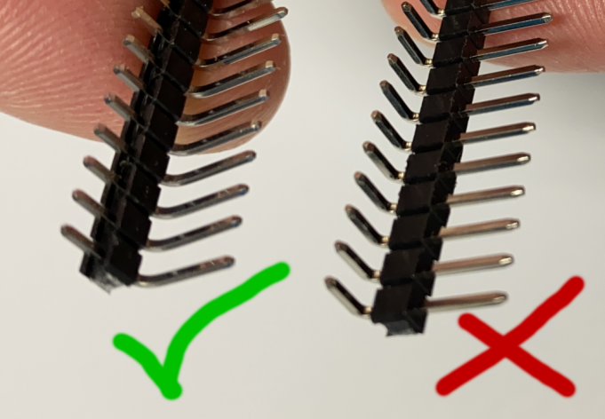
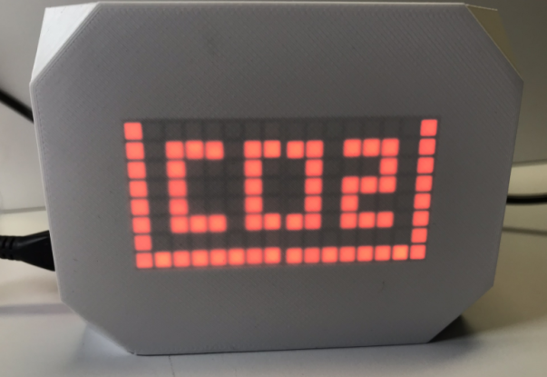
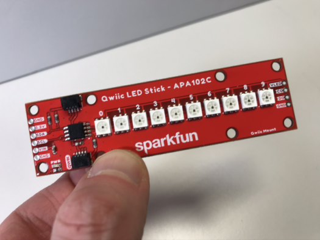

# 1. Hardware selection

There are a number of options when it comes to selecting hardware for the IAQ. Cost, availability and performance are some factors to consider when choosing the parts below.

## Choosing your Pi

The IAQ runs on a Raspberry Pi, so you'll need one of the following compatible devices:

- A [Pi 3A+](https://www.raspberrypi.com/products/raspberry-pi-3-model-a-plus/) or [Pi Zero 2 W](https://www.raspberrypi.com/products/raspberry-pi-zero-2-w/) will fit in the custom case, so one of these is the best choice
- A [Pi 3B](https://www.raspberrypi.com/products/raspberry-pi-3-model-b/), [Pi 3B+](https://www.raspberrypi.com/products/raspberry-pi-3-model-b-plus/), [Pi 4](https://www.raspberrypi.com/products/raspberry-pi-4-model-b/), [CM4](https://www.raspberrypi.com/products/compute-module-4/?variant=raspberry-pi-cm4001000) or [CM3+](https://www.raspberrypi.com/products/compute-module-3-plus/) based system (Like the [balenaFin](https://www.balena.io/fin/)) will work fine but will not fit in the custom case.

(The IAQ is not compatible with the Pi Zero or first generation Pi)  

The IAQ is not particularly resource-intensive, so any of the supported boards above should work equally well. Note that currently the Pi Zero 2 W is only available without headers soldered in place. If you choose this device, you'll need to solder headers or wires onto the board. You could also try a "[solderless hammer header](https://shop.pimoroni.com/products/gpio-hammer-header?variant=35643318026)" although we have not tested these.

## Choosing your sensors

The sensors evaluate your air and return data that is used to deterime your air quality score. The IAQ utilizes the [big sensor block](https://github.com/alanb128/big-sensor) so supports any of the sensors listed [here](https://github.com/alanb128/big-sensor#currently-supported-sensors). However, you'll want to use a supported sensor that returns one or more of the following values:

- CO2
- eCO2
- temperature
- humidity
- pm100 env
- pm25 env

 Typically, one or more of the following sensors are used, depending on your budget and air quality analysis needs.

| Sensor | Detects | Description | cost (USD) | specifications (approx.) |
| ------------ | ----------- | ----------- | ----------- | ----------- |
| [PMSA003I](https://www.adafruit.com/product/4632) | Smoke, dust, dirt, pollen particles | laser-scattering type | $44.95 | 0.3-1.0,1.0-2.5, 2.5-10 Micrometer particles ([datasheet](https://cdn-shop.adafruit.com/product-files/4632/4505_PMSA003I_series_data_manual_English_V2.6.pdf)) |
| [SCD-40](https://www.adafruit.com/product/5187) | Exhaled breath and burning fossil fuels |  CO2 photoacoustic sensor CO2 (plus temp and humidity) | $44.94 | 400 - 2000 PPM ([datasheet](https://cdn-learn.adafruit.com/assets/assets/000/104/015/original/Sensirion_CO2_Sensors_SCD4x_Datasheet.pdf?1629489682)) |
| [SGP-30](https://www.adafruit.com/product/3709) | Gasses emitted by solid and liquid products  |  VOC (and eCO2) Hot-plate MOX sensor | $17.50 | eCO2 400-60,000 ppm, TVOC 0-60,000 ppb ([datasheet](https://cdn-learn.adafruit.com/assets/assets/000/050/058/original/Sensirion_Gas_Sensors_SGP30_Datasheet_EN.pdf)) |
| [ENS160](https://www.adafruit.com/product/5606) | Gasses emitted by solid and liquid products  |  VOC (and eCO2) MOX gas sensor | $21.95 | eCO2 400-65,000 ppm, TVOC 0-65,000 ppb ([datasheet](https://cdn-learn.adafruit.com/assets/assets/000/115/331/original/SC_001224_DS_1_ENS160_Datasheet_Rev_0_95-2258311.pdf?1663951433)) |

All of these sensors use the popular I2C protocol to communicate with the Pi and include [Qwiic](https://www.sparkfun.com/qwiic) connectors so you don't need to do any soldering to use these sensors.

The IAQ will automatically detect which sensors are present and caluclate the air quality score accordingly. If you connect the specified VOC sensor but do not have the specified CO2 sensor attached, the VOC sensor's eCO2 readings will be reported as the CO2 values. (eCO2 is generally less accurate than CO2 and requires proper calibration)

## Choosing your display

Each IAQ device has a bright LED display so you can read your score from across a room. The score will be calculated and displayed even if your device is not connected to the internet. Regardless of the display type you choose, you can still obtain detailed sensor and air quality score readings from the built-in web dashboard.

### Two digit bi-color LED matrix

This is the most detailed display and also the most expensive. It utilizes two $15.95 [LED Square Pixel Matrix with I2C Backpack](https://www.adafruit.com/product/902) boards which require some light soldering to mount the display to the backpack. Recent versions of the backpack include a qwiic connector, but older ones will need to use angled headers, not the straight ones included with the boards. These should be right-angled male headers where the right angle occurs above the plastic strip [like these](https://www.amazon.com/Uxcell-a15062500ux0349-Single-40-pin-Breadboard/dp/B01461DQ6S/), NOT below the strip [like these](https://www.adafruit.com/product/1540). (A subtle difference but one type will fit in the case while the other will not!) 

If you are not using our custom case, you can just use the headers that are included with the display boards. These displays can be mounted directly on posts in the custom case with no modifications required.

The matrix displays are driven via I2C and if they do not have qwiic connectors, will require two [Qwiic to female header](https://www.adafruit.com/product/4397) cables to connect to the Pi. 

In addition to displaying the two digit score, these displays can optionally show the most dominant pollutant type (CO2, PM10, PM2.5, VOC) detected by the sensors, as well as some rudimentary animations. The displayed information will change color from green to orange to red depending on the score.

To summarize the parts for this option:

- Two [LED Square Pixel Matrix with I2C Backpack](https://www.adafruit.com/product/902)

- One [50mm QT to QT cable](https://www.adafruit.com/product/4399) to connect the first LED to the second.

If the backpack does not include qwiic connectors:

- One strip of [angled male headers](https://www.amazon.com/Uxcell-a15062500ux0349-Single-40-pin-Breadboard/dp/B01461DQ6S/)

- One additional [Qwiic to female header](https://www.adafruit.com/product/4397) cable to connect the second backpack to the multiport

- One SparkFun Qwiic multiport, available [here](https://www.adafruit.com/product/4861) and [here](https://www.sparkfun.com/products/18012)

### Eight LED multi-color bargraph

This type of display is less detailed than the two digit matrix (the score is broken into eight segments with each one representing 12.5 points) and can't display the pollutant type. It does however have multiple color indications and can be configured in three different display formats. No soldering is required with this option

This display is $11 or about a third the cost of the LED matrix and is based on the 10 LED [SparkFun Qwiic Stick](https://www.sparkfun.com/products/18354). (We only use eight of the ten LEDs that neatly fit the IAQ's case window.) In addition to one of these displays, you'll need a [100mm QT to QT cable](https://www.adafruit.com/product/4210) to connect it to the IAQ.

With this option, you'll also need a SparkFun Qwiic multiport, available [here](https://www.adafruit.com/product/4861) and [here](https://www.sparkfun.com/products/18012)

## Remaining parts list

With either display, you'll also need the following parts:

- One [Qwiic to female header cable](https://www.adafruit.com/product/4397) to connect the display to the Pi

- One [200mm QT to QT cable](https://www.adafruit.com/product/4401) to connect the display to the first sensor.

- One [100mm QT to QT cable](https://www.adafruit.com/product/4210) to connect the first sensor to the second sensor. Only required if you have two or three sensors!

- Another [100mm QT to QT cable](https://www.adafruit.com/product/4210) to connect the second sensor to the third sensor. Only required if you have three sensors!

Note that there are some additional hardware requirements if you will be using the custom 3D printed case - see [this section](05-case-printing-and-assembly.md) for details.

### NEXT
[2. Hardware Setup](02-hardware-setup.md)
