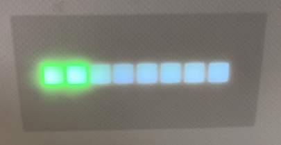
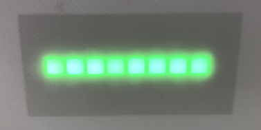

# 4. IAQ usage and configuration

After you have put together the hardware, installed the software and (optionally) assembled the case, you can power on the IAQ by plugging a standard 5V/2.5A or greater power transformer into the Pi's micro USB port. After about a minute, the air quality score should be visible on the display. Sensor readings are taken approximately once per minute.

## The IAQ score

The easy-to-remember IAQ score ranges from 0 (best air quality) to 99 (hazardous air quality). Each sensor has a range of readings that are categorized as "good", "moderate", or "unhealthy". These rages are based in part on various governmental standards, such as [the EPA](https://www3.epa.gov/region1/airquality/pm-aq-standards.html) and others.

| Reading | Description | Sensor Type | good range (0 - 50) | moderate range (51 - 74) | unhealthy range (75 - 99) |
| ------------ | ----------- | ----------- | ----------- | ----------- | ----------- |
| PM2.5 | Smoke, dust, dirt, pollen | PMSA003I | 12 - 34 ug/m3 | 35 - 54 ug/m3 | 55+ ug/m3 |
| PM10 | Dust, smoke, exhaust, tiny particles | PMSA003I | 0 - 53 ug/m3 | 54 - 149 ug/m3 | 150+ ug/m3 |
| CO2 | Exhaled breath and burning fossil fuels | SCD-40 | 400 - 999 PPM | 1000 - 1999 PPM | 2000+ PPM |
| VOC | Gasses emitted by solid and liquid products  | SGP-30 | 0 - 499 PPB | 500 - 999 PPB | 1000+ PPB |

**The final score displayed by the device is the highest score from among all the available sensors.**

## Display options

### LED Matrix display
By default, the display will constantly show the score if the value is below 50. Once the score is over 50, an icon representing the dominant pollutant will alternate on the display along with the score. These icons are:

- "CO2" representing carbon dioxide (CO2)
- "PM1" representing PM 10 (particulate matter 10 micrometers or less in diameter)
- "PM2" representing PM 2.5 (particulate matter 2.5 micrometers or less in diameter)
- "VOC" representing Volatile Organic Compunds (VOC)

When you first power on the device, it will cycle through the connected sensors and briefly display the icon above for each one found. If no sensors are found, the display will show "??". 

You can change the default behavior of the icon display by setting the following [device variables](https://www.balena.io/docs/learn/manage/variables/#device-variables) in your balenaCloud dashboard:

`ALERT_LEVEL` changes the threshhold value for alternating the display of the pollutant. The default value is 50 but you can change it by setting this value. 

`ALERT_MODE` has a default value of `1`, which causes the display to alternate the pollutant icon when the score exceeds the `ALERT_LEVEL` defined above. Changing this value to `0` will cause the score to always be displayed and never display a pollutant icon regardless of the `ALERT_LEVEL`. Setting this value to 2 will always show an alternating pollutant icon regardless of the `ALERT_LEVEL`.

Note that these variables will not initially be present in the dashboard, you will have to add them if you want to change their value. If they have not been added, or you delete them after previously adding them, they will revert back to the default values mentioned above.

The display changes color based on the score as follows:

| Score range | Description | LED display color | 
| ------------ | ----------- | ----------- |
| 0 - 49 | Good air quality | green |
| 50 - 74 | Moderate air quality | orange |
| 75 - 99 | Unhealthy air quality | red |

### LED bargraph display

By default the bargraph display will illuminate a segment from left to right based on the IAQ score, with each segment representing 12.5 points. The segments will be lit according to the color scheme shown above for the matrix display. Any unused segments to the right will be slightly illuminated in white. To eliminate the white segments, set the device variable `BAR_MODE` to `0`.

If you set the `BAR_MODE` to `2` all of the LED segments will always be illuminated in either green, yellow, or red depending on the IAQ sore as shown above. 

To reset the display to the default mode, set `BAR_MODE` to `1` or delete the variable.

If the score is zero and you are using display mode 2, no LED segments will be illuminated. To force the leftmost LED segment to be lit even if the score is zero, set the `ZERO_BAR` variable to a value of `1`.

Upon initial startup, if no sensors are detected the bargraph display will show alternating red and green segments.

## The IAQ dashboard
The IAQ dashboard is a pre-built [Grafana](https://grafana.com/grafana/) dashboard that shows you the current and historical values from all of your sensors as well as the air quality score over time. If you are on the same network as the device, you can browse to IAQ.local or to the local IP address of the device (which you can find on its balenaCloud dashboard) to see the dashboard. If you want to enable access to the IAQ dashboard from outside your network, you can enable the "Public Device URL" from your balenaCloud dashboard and then click the icon next to that switch to view its public URL.

To modify the IAQ dashboard or add your own, you can log into Grafana with the arrow icon in the lower left of the screen. The default username and password are admin/admin. If you want to experiment with making changes to the dashboard, you can copy the default dashboard and make changes to it so you don't risk making inadvertent alterations.

See the [Grafana documentation](https://grafana.com/docs/grafana/next/panels/working-with-panels/) for more information about modifying/designing dashboards.

## Other configuration options

### Logging
By default, the IAQ service will only send certain information to the logs. If you want to see more or less detail in the logs, you can set the `LOG_LEVEL` device variable. The default value is `WARNING` but setting to `DEBUG` or `INFO` will provide more logging detail. To see fewer logging details, you can select `ERROR` or `CRITICAL` as well.

### External MQTT

You can have the balenAir publish to an external MQTT broker or service, such as the [balenAir Aggregator](https://github.com/balenair/aggregator). To initiate this, set the `AGG_ADDRESS` variable to the address of the external MQTT broker - this works best if all devices are on the same local network. See the Aggregator repo for more details on other setup options. You can also specify `AGG_USERNAME`, `AGG_PASSWORD`, and `AGG_PORT` (default is 1883) as well. To stop publishing, delete the `AGG_ADDRESS` variable.

## VOC calibration
The [SGP30 VOC sensor](https://www.adafruit.com/product/3709) is a type of gas sensor that needs to be calibrated to provide reasonably accurate measurements. The balenAir no longer stores a baseline for this sensor, so see the details [here](https://learn.adafruit.com/adafruit-sgp30-gas-tvoc-eco2-mox-sensor/circuitpython-wiring-test#baseline-set-and-get-2980177) regarding its default calibration process.

### NEXT
[Case printing & assembly](05-case-printing-and-assembly.md)
